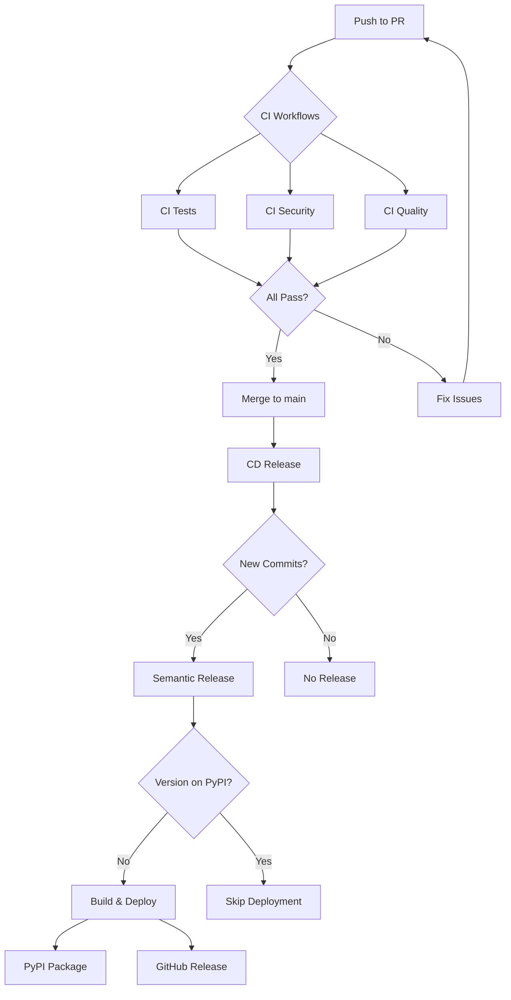

# CI/CD Pipeline Documentation

## Overview

The fx_bin project uses a modern CI/CD pipeline built with GitHub Actions, featuring clear separation between Continuous Integration (CI) and Continuous Deployment (CD) workflows.

## Architecture

```
┌─────────────────────────────────────────────────────────────────┐
│                         Pull Request                             │
├─────────────────────────────────────────────────────────────────┤
│                                                                  │
│  ┌──────────────┐  ┌──────────────┐  ┌──────────────┐         │
│  │  CI Tests    │  │ CI Security  │  │  CI Quality  │         │
│  │              │  │              │  │              │         │
│  │ • Unit Tests │  │ • Bandit     │  │ • Flake8     │         │
│  │ • Integration│  │ • Safety     │  │ • MyPy       │         │
│  │ • Coverage   │  │ • Safety     │  │ • Black      │         │
│  │              │  │   Tests      │  │ • Performance│         │
│  └──────────────┘  └──────────────┘  └──────────────┘         │
│                                                                  │
│         All workflows run in parallel ⚡                        │
└─────────────────────────────────────────────────────────────────┘
                              │
                              │ Merge to main
                              ▼
┌─────────────────────────────────────────────────────────────────┐
│                      CD Release (main branch)                    │
├─────────────────────────────────────────────────────────────────┤
│                                                                  │
│  1. Semantic Release (analyze commits)                          │
│  2. Version bump + Changelog + Git tag                          │
│  3. Create GitHub Release                                       │
│  4. Check PyPI (skip if version exists)                         │
│  5. Build package (wheel + sdist)                               │
│  6. Upload artifacts to GitHub Release                          │
│  7. Deploy to PyPI                                              │
│                                                                  │
└─────────────────────────────────────────────────────────────────┘
```

## CI Workflows (Pull Requests)

All CI workflows run on:
- Pull requests to `main`
- Pushes to `develop` branch

### 1. CI Tests (`.github/workflows/ci-test.yml`)

**Purpose:** Validate code functionality and test coverage

**Jobs:**
- **Unit & Integration Tests**
  - Runs tests in `tests/` directory
  - Uses pytest with detailed output
  - **Excludes:** `tests/runners/`, `tests/performance/` (non-blocking)
- **Code Coverage**
  - Generates coverage reports (XML + HTML)
  - Uploads to Codecov (non-blocking)
  - Tracks coverage trends
  - Also excludes performance tests from coverage

**Configuration:**
```yaml
concurrency:
  group: ${{ github.workflow }}-${{ github.ref }}
  cancel-in-progress: true  # Cancel old runs on new push
```

**Python Version:** 3.12

**Key Features:**
- Parallel execution with other CI workflows
- Automatic cancellation of outdated runs
- Coverage upload with failure visibility

---

### 2. CI Security (`.github/workflows/ci-security.yml`)

**Purpose:** Identify security vulnerabilities in code and dependencies

**Jobs:**
1. **Security Scan**
   - **Bandit:** Static security analysis of Python code
     - Generates JSON report (machine-readable)
     - Displays console output (human-readable)
   - **Safety:** Checks dependencies for known CVEs
     - Non-blocking warnings for known issues
   - Uploads security reports as artifacts

2. **Safety Tests** (depends on Security Scan)
   - Runs comprehensive safety test suite
   - Located in `tests/security/`
   - **CRITICAL:** Must pass before deployment

**Configuration:**
```yaml
concurrency:
  group: ${{ github.workflow }}-${{ github.ref }}
  cancel-in-progress: true
```

**Python Version:** 3.12

---

### 3. CI Quality (`.github/workflows/ci-quality.yml`)

**Purpose:** Enforce code quality standards and style consistency

**Jobs:**

1. **Code Quality**
   - **Flake8:** Linting for PEP 8 compliance
   - **MyPy:** Type checking (continue-on-error until types are fixed)
   - **Black:** Code formatting verification

2. **Performance Tests**
   - Runs performance benchmarks
   - **Informational only** (continue-on-error: true)
   - Located in `tests/performance/`
   - **Does not block PRs** (failures are reported but don't fail the build)

**Configuration:**
```yaml
concurrency:
  group: ${{ github.workflow }}-${{ github.ref }}
  cancel-in-progress: true
```

**Python Version:** 3.12

**Note:** MyPy failures don't block PRs (marked for future improvement)

---

## Design Rationale: Non-Blocking Performance Tests

Performance tests are intentionally separated and marked as **non-blocking** for several reasons:

1. **Flaky by Nature:** Benchmark timing can vary based on:
   - GitHub Actions runner load
   - Network conditions
   - System resource availability

2. **Slow Execution:** Performance tests can take significantly longer than unit tests
   - Would slow down PR feedback cycles
   - Not suitable for rapid iteration

3. **Informational Value:** Performance tests provide:
   - Trend analysis over time
   - Early warning for regressions
   - But shouldn't block feature development

4. **Separate from Correctness:**
   - Functional correctness (unit/integration tests) → Blocking
   - Performance characteristics (benchmarks) → Informational

This architecture ensures fast PR feedback while still tracking performance trends.

---

## CD Workflow (Main Branch)

### CD Release (`.github/workflows/cd-release.yml`)

**Purpose:** Automated semantic versioning and deployment

**Trigger:** Push to `main` branch (typically via merged PR)

**Concurrency:**
```yaml
concurrency:
  group: release
  cancel-in-progress: false  # Never cancel releases
```

**Recursion Prevention:**
```yaml
if: |
  github.actor != 'github-actions[bot]' &&
  !contains(github.event.head_commit.message, 'chore(release):')
```

#### Release Process

**Step 1: Semantic Release**
- Analyzes conventional commits since last release
- Determines version bump (major/minor/patch)
- Generates changelog
- Creates Git tag
- Creates GitHub Release

**Step 2: Version Check**
- Queries PyPI API to check if version exists
- Skips deployment if version already published
- Adds job summary for visibility

**Step 3: Build Package**
- Installs dependencies with Poetry
- Builds wheel (`.whl`) and source distribution (`.tar.gz`)

**Step 4: Upload to GitHub Release**
- Waits for release availability (retry logic: 10 attempts, 3s delay)
- Uploads all build artifacts with error handling
- Validates successful upload for each file

**Step 5: Deploy to PyPI**
- Uses trusted publishing (OIDC)
- Skip-existing flag as backup safety net
- Only runs if version doesn't exist on PyPI

**Step 6: Job Summary**
- Displays deployment status
- Includes package links and installation commands
- Shows skip reason if applicable

#### Secrets Required

| Secret | Purpose | Scope |
|--------|---------|-------|
| `SEMANTIC_RELEASE_PAT` | Git operations, GitHub Release creation | `contents: write` |
| `PYPI_API_TOKEN` | PyPI package upload | PyPI trusted publishing |

---

## Workflow Files Summary

| File | Trigger | Purpose | Blocks PRs? |
|------|---------|---------|-------------|
| `ci-test.yml` | PR, develop push | Unit/integration tests | ✅ Yes |
| `ci-security.yml` | PR, develop push | Security scanning | ✅ Yes |
| `ci-quality.yml` | PR, develop push | Code quality | ⚠️ Partial (MyPy continues on error) |
| `cd-release.yml` | main push | Versioning & deployment | N/A |
| `codeql.yml` | Schedule, PR | GitHub security analysis | ❌ No |
| `claude.yml` | Manual | Claude Code integration | ❌ No |

---

## Conventional Commits

The CD pipeline uses semantic-release with conventional commits:

### Commit Types

| Type | Version Bump | Example |
|------|--------------|---------|
| `feat:` | Minor (0.X.0) | `feat: add new filter command` |
| `fix:` | Patch (0.0.X) | `fix: resolve path traversal bug` |
| `perf:` | Patch (0.0.X) | `perf: optimize file scanning` |
| `docs:` | None | `docs: update README` |
| `chore:` | None | `chore: update dependencies` |
| `test:` | None | `test: add integration tests` |

### Breaking Changes

Add `BREAKING CHANGE:` in commit body to trigger major version bump:

```
feat: redesign CLI interface

BREAKING CHANGE: Command arguments have changed.
Old: fx files --dir ./src
New: fx files ./src
```

---

## Performance & Optimization

### CI Execution Time

- **Before restructure:** ~15-20 minutes (sequential)
- **After restructure:** ~8-10 minutes (parallel)
- **Time savings:** ~50% faster feedback

### Caching

All workflows use pip caching:
```yaml
- uses: actions/setup-python@v5
  with:
    python-version: "3.12"
    cache: 'pip'  # Cache pip dependencies
```

### Concurrency Controls

- **CI workflows:** Cancel old runs on new push
- **CD workflow:** Never cancel (prevent partial deployments)

---

## Job Summaries

All workflows produce GitHub Actions job summaries for visibility:

### CI Tests
- ✅ Test results
- ⚠️ Coverage upload status

### CD Release
- 🎉 New version released
- ✅ Deployment successful (with links)
- ⏭️ Deployment skipped (with reason)
- ℹ️ No release needed

---

## Troubleshooting

### Release Not Created

**Symptom:** CD workflow runs but no version bump occurs

**Causes:**
1. No conventional commits since last release
2. Only `chore:`, `docs:`, or `test:` commits (no version bump)

**Solution:** Ensure at least one `feat:`, `fix:`, or `perf:` commit

---

### Version Already Exists on PyPI

**Symptom:** Deployment skipped with "version exists" message

**Causes:**
1. Manual version bump in `pyproject.toml` without new commits
2. Re-running workflow after successful deployment

**Solution:**
```bash
# Add a new commit to trigger version bump
git commit --allow-empty -m "chore: trigger release"
git push
```

---

### PyPI Upload Fails

**Symptom:** Build succeeds but PyPI deployment fails

**Common Causes:**
1. Invalid `PYPI_API_TOKEN`
2. Package name conflict
3. Metadata validation errors

**Solution:**
1. Verify token in GitHub Secrets
2. Check package name availability on PyPI
3. Review build logs for metadata issues

---

### GitHub Release Artifact Upload Timeout

**Symptom:** Release created but artifacts not attached

**Causes:**
1. Slow network connection
2. Large build artifacts

**Solution:**
The workflow includes automatic retry logic (10 attempts, 30s total). If still failing, check:
```bash
# Verify artifacts were built
ls -lh dist/
```

---

## Manual Release (Emergency)

If automated release fails, manual deployment:

```bash
# 1. Bump version manually
poetry version patch  # or minor/major

# 2. Commit version bump
git add pyproject.toml fx_bin/__init__.py
git commit -m "chore(release): bump version to X.Y.Z"
git tag vX.Y.Z
git push && git push --tags

# 3. Build and upload
poetry build
poetry publish  # Requires PyPI token configured
```

---

## Security Considerations

### Branch Protection

Recommended settings for `main` branch:
- ✅ Require pull request reviews
- ✅ Require status checks: `CI Tests`, `CI Security`, `CI Quality`
- ✅ Require linear history
- ❌ Allow force pushes

### Secrets Management

- `SEMANTIC_RELEASE_PAT`: Fine-grained PAT with minimal scope
- `PYPI_API_TOKEN`: Use trusted publishing (OIDC) when possible
- Never log secrets in workflow outputs

### Dependency Updates

- Run `poetry update` regularly
- Check `safety check` output for CVEs
- Review Dependabot PRs promptly

---

## Future Improvements

### Planned Enhancements
1. [ ] Fix MyPy type errors (remove `continue-on-error`)
2. [ ] Add automated dependency updates (Dependabot)
3. [ ] Implement test result caching
4. [ ] Add integration test for release workflow
5. [ ] Create release candidate workflow for pre-releases

### Performance Optimizations
1. [ ] Use matrix strategy for multi-Python version testing
2. [ ] Implement Docker layer caching
3. [ ] Add test result reporting (GitHub Checks)

---

## Related Documentation

- [Commit Message Guide](./commit-message-guide.md)
- [Testing Guide](./testing/)
- [Project Status](./project-status.md)

---

## Workflow Visualization



---

**Last Updated:** 2026-01-05
**Maintained By:** @frankyxhl
