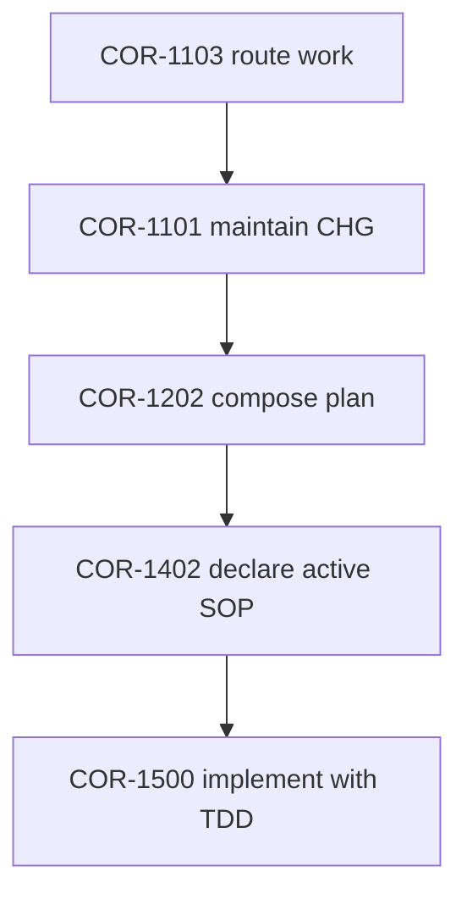

# CHG-2100: Add FX Open Launcher Command

**Applies to:** FXB project
**Last updated:** 2026-05-04
**Last reviewed:** 2026-05-04
**Status:** Completed
**Related:** COR-1101, COR-1202, COR-1500
**Date:** 2026-05-04
**Requested by:** Frank Xu
**Priority:** Medium
**Change Type:** Normal
**Scheduled:** TBD

---

## What

Add a new `fx open` launcher command for quickly listing, opening, and adding
frequently used URLs and local files. The command will use a local TOML registry
for named launch targets and support browser/app selection for testing and
context-specific workflows.


## Why

The user wants to avoid keeping many browser tabs open while retaining fast
access to recurring resources such as usage dashboards, documentation pages,
local images, and files. The command should act like a lightweight Alfred-style
launcher inside the existing `fx` CLI.


## Impact Analysis

- **Systems affected:**
  - `fx_bin/cli.py` command registration and `COMMANDS_INFO`
  - New launcher implementation module, likely `fx_bin/open_launcher.py`
  - `fx_bin/errors.py` for an `OpenError(FxBinError)` style error
  - Unit, integration, and security tests
  - README and docs site command documentation
- **Channels affected:** None
- **Downtime required:** No
- **Runtime dependencies:** None planned for v1
- **Rollback plan:** Revert the implementation commit(s), remove the `fx open`
  CLI registration, and leave any user-local config file untouched.


## Implementation Plan

1. Define the launcher contract in this CHG and keep the initial scope additive.
2. Implement config loading from `~/.config/fx-bin/open.toml` with `--config`
   override.
3. Implement deterministic listing with 1-based positional indices, ordered by
   explicit `order`, then `name`, then `slug`.
4. Implement tag filtering with `--tag`. When opening by index with `--tag`, the
   index applies to the filtered list; when opening by slug with `--tag`, the
   selected entry must match the filter.
5. Implement exact slug selection and index selection.
6. Implement direct URL/path opening:
   - URL schemes: `http` and `https`
   - Local files/images as filesystem paths
   - Reject unsupported schemes such as `javascript:`, `data:`, and `file://`
7. Implement browser/app override behavior:
   - `--browser` for URL targets
   - `--app` for local targets
   - Reject the wrong override type with a clear error
8. Implement `fx open add <target>`:
   - deterministic metadata generation
   - explicit `--name`, `--slug`, and repeatable `--entry-tag`
   - duplicate/reserved slug validation
   - add-only TOML writer with full re-parse validation
   - confirmation prompt, with `--yes` required in non-interactive mode
   - bare domains such as `yahoo.co.jp` normalized to `https://yahoo.co.jp`
9. Add optional `--ai` metadata enrichment behind a mockable interface. AI must
   remain optional and must never bypass validation or preview/confirmation
   rules.
10. Add comprehensive `--help`, README, and docs-site documentation with examples
   suitable for humans and AI assistants.
11. Verify via focused tests first, then broader regression checks when the
    Poetry environment is available.


## Command Contract

### CLI Shape

`fx open` is a single flat Click command, not a nested Click command group. The
implementation should register one command with `@cli.command(name="open")` and
parse positional tokens with `@click.argument("tokens", nargs=-1)`.

Routing rules:

- No token lists saved entries.
- First token `add` enters the add workflow: `fx open add <target>`.
- Any other first token is a selector/direct target: `fx open <token>`.
- `--tag` is always the list/open filter option.
- `--entry-tag` is always add-entry metadata and is invalid outside `add`.
- `--name`, `--slug`, `--entry-tag`, `--yes`, and `--ai` are invalid unless the
  first token is `add`.

This keeps `fx open --tag usage 2` and
`fx open add https://example.com --entry-tag docs` unambiguous for Click,
humans, and AI assistants.

### Examples

```bash
fx open
fx open cc-usage
fx open 3
fx open --tag usage
fx open --tag usage 2
fx open add yahoo.co.jp
fx open add https://yahoo.co.jp --name "Yahoo! JAPAN" --slug yahoo-jp --entry-tag portal --entry-tag japan
fx open --config ./open.toml add https://example.com --yes
```

macOS-only override examples:

```bash
fx open cc-usage --browser "Google Chrome"
fx open ./diagram.png --app Preview
fx open https://example.com --browser Firefox
```

### Config Path

Default config path:

- POSIX/macOS: `${XDG_CONFIG_HOME}/fx-bin/open.toml` when `XDG_CONFIG_HOME` is
  set, otherwise `~/.config/fx-bin/open.toml`
- Windows: `%APPDATA%\fx-bin\open.toml` when `APPDATA` is set, otherwise
  `~/.config/fx-bin/open.toml` under the user's home directory

`--config` overrides the default path for list, open, and add workflows.
`fx open add` must create the config parent directory when it does not exist.

### Config Example

```toml
[[items]]
order = 10
name = "Claude Code usage"
slug = "cc-usage"
target = "https://example.com/claude-code-usage"
tags = ["usage", "claude-code"]
browser = "Google Chrome"
```

### TOML Schema

The config root contains only `items`, a list of tables. Unknown root keys are
ignored for forward compatibility; unknown item keys are rejected in v1 so typos
surface early.

Supported item fields:

| Field | Type | Required | Notes |
|-------|------|----------|-------|
| `name` | string | yes | display name |
| `slug` | string | yes | stable selector |
| `target` | string | yes | URL or local path |
| `order` | non-negative integer | no | sort key |
| `tags` | list of strings | no | defaults to `[]` |
| `browser` | string | no | URL targets only, macOS override |
| `app` | string | no | local targets only, macOS override |

`fx open add` assigns default `order` as max existing integer order plus 10,
starting at 10 when no ordered entries exist. Duplicate `target` values are
allowed because a user may want the same URL with different tags, names, or
browser defaults; duplicate slugs are rejected.

Add target normalization:

- `http://` and `https://` targets are stored as provided.
- Bare domain targets matching a host such as `yahoo.co.jp` are stored as
  `https://yahoo.co.jp`.
- Existing local file targets are stored as normalized absolute paths.
- Other values fail with guidance to provide an `http(s)` URL, bare domain, or
  existing local file.

Deterministic slug generation:

1. URL targets use the host, lowercased, with a leading `www.` removed. Path
   segments are not included in the default slug.
2. Local targets use the filename stem when present; otherwise they use the final
   path component.
3. The base text is ASCII-normalized, lowercased, and all runs of characters
   outside `[a-z0-9_-]` are replaced with `-`.
4. Leading non-letter characters are stripped. If no valid leading letter
   remains, prefix `link-`.
5. The slug is trimmed to 64 characters and trailing `-` or `_` characters are
   removed.
6. The result must still match the slug grammar and must not be reserved or
   duplicated. If it fails, the command exits with guidance to provide `--slug`;
   it does not silently suffix slugs.

When `--name` is omitted, deterministic name generation title-cases the final
slug after replacing `-` and `_` with spaces. For example,
`https://www.yahoo.co.jp` generates slug `yahoo-co-jp` and name
`Yahoo Co Jp`.

### Slug Rules

Slugs must match `^[A-Za-z][A-Za-z0-9_-]{0,63}$`, must be unique, and must not
collide with registered or reserved `fx open` subcommands. Slug matching is
case-sensitive in v1; generated slugs are lowercase, but hand-authored mixed
case slugs must be opened with the same case.

Reserved v1 slug names:

- `add`
- `remove`
- `rm`
- `edit`
- `list`
- `delete`
- `help`

These are reserved even if not all are implemented in v1, to avoid breaking
user configs when lifecycle subcommands are added later.

### Selector Precedence

For `fx open <token>`, selection is deterministic:

1. `http://` and `https://` tokens are direct URLs.
2. Explicit path tokens are local paths. A token is explicit path-like if it:
   - starts with `.`, `/`, or `~`
   - contains `/` on POSIX/macOS
   - contains `/` or `\` on Windows
   - is a Windows drive-letter path matching `^[A-Za-z]:[/\\]`, such as
     `C:\work\file.png` or `C:/work/file.png`
3. Numeric tokens are 1-based positional indices in the current filtered view.
4. Exact slug match wins over a bare local filename. If `--tag` is specified,
   slug matching is evaluated only against the filtered view; a slug that exists
   outside the filtered view is not opened and returns a clear filter-mismatch
   error instead of falling through to a local file.
5. If no slug matches and the bare token exists as a local path, open that path.
6. Otherwise return a not-found error with guidance to run `fx open`.

Local-path selector results must be regular files after resolving symlinks to a
normalized absolute path. Directories, sockets, devices, symlink loops, NUL-byte
paths, and paths containing unsupported control characters are rejected.

Examples:

- `fx open readme` opens slug `readme` if configured; otherwise it opens local
  file `readme` if it exists.
- `fx open ./readme` always means local path.
- `fx open 3` means index 3.
- `fx open ./3` means local path named `3`.
- `fx open 0` and negative numeric selectors are invalid indices and exit 1.

### Tag Option Ownership

`--tag` has one meaning in v1: it filters the list/open view before listing or
selector resolution. `fx open --tag usage 2` opens index 2 in the filtered view.

Add-entry metadata uses repeatable `--entry-tag`:

```bash
fx open add https://example.com --entry-tag docs --entry-tag reference
```

Using `--tag` with the add workflow must fail with a clear error explaining that
add metadata uses `--entry-tag`.

### TOML Write Strategy

Python 3.11 provides `tomllib` for reading TOML but not writing TOML. v1 will
avoid a new runtime dependency by using an add-only writer. The operation is
append-only in behavior, but the implementation performs a full file rewrite so
the candidate document can be parsed and validated before commit:

1. Create the config parent directory if needed.
2. Acquire an add-operation lock file in the config directory using exclusive
   creation before reading the config. If the lock exists and is not stale, fail
   with a clear "config is locked" error.
3. Treat a lock as stale only when its mtime is older than 10 minutes. Stale lock
   removal must be best-effort and followed by a fresh exclusive-lock attempt.
4. While holding the lock, read the existing file as text, or start with an empty
   document when missing.
5. Escape strings deterministically as TOML basic strings:
   - `\` becomes `\\`
   - `"` becomes `\"`
   - tab, newline, carriage return, backspace, and form feed use TOML escapes
   - other control characters are rejected
   - non-control Unicode is emitted as literal UTF-8
6. Build the append candidate from the locked snapshot, not from any pre-lock
   snapshot.
7. Parse the full candidate document with `tomllib`.
8. Run full schema validation, including duplicate/reserved slug checks.
9. Write to a temp file in the config directory and atomically replace the
   config with `os.replace`.
10. Release the lock in a `finally` block.

If parse or validation fails, the original config file must remain unchanged.

### Opener Dispatch Strategy

Opening must use argument-vector subprocess calls or platform APIs, never shell
string execution.

- macOS:
  - default open: `open <normalized-target>`
  - app/browser override: `open -a <AppName> <normalized-target>`
- Linux:
  - default open: `xdg-open <normalized-target>` if available
  - missing `xdg-open` returns a clear opener-unavailable error
  - explicit app/browser override is out of scope for v1 and should return a
    clear unsupported-platform error
- Windows:
  - default open: `os.startfile(target)` or equivalent safe platform API
  - explicit app/browser override is out of scope for v1 and should return a
    clear unsupported-platform error

Local paths must be resolved to normalized absolute paths before dispatch. This
prevents targets beginning with `-` from being interpreted as opener flags.
Browser/app names beginning with `-` are invalid in config and CLI input. URL
targets must use `http` or `https`, so they cannot be confused with opener
flags. Empty browser/app names are invalid.

Tests should assert the generated dispatch plan instead of launching real
applications.

### AI Metadata Contract

`--ai` is optional and testable without adding a runtime dependency. In v1 it
uses an external provider command configured by `FX_OPEN_AI_COMMAND`.

Request sent to the provider on stdin:

```json
{"target":"https://example.com","existing_slugs":["example"],"allowed_fields":["name","slug","tags"]}
```

Expected provider stdout:

```json
{"name":"Example","slug":"example-docs","tags":["docs"]}
```

Rules:

- If `FX_OPEN_AI_COMMAND` is unset and `--ai` is used, exit 1 with setup
  guidance.
- `FX_OPEN_AI_COMMAND` must be split into a platform-aware argument vector and
  executed with `shell=False`; shell evaluation is forbidden. Values that cannot
  be safely split fail before provider execution. Windows provider paths with
  spaces are supported when quoted, for example
  `"C:\Program Files\Fx AI\provider.exe" --mode json`.
- Provider execution times out after 10 seconds and exits 1 with a timeout
  message.
- Provider non-zero exit exits 1 with the provider exit code.
- Invalid JSON exits 1 with a parse error and a short stdout preview.
- Provider output must be valid JSON.
- Only `name`, `slug`, and `tags` are accepted from AI.
- AI output is validated with the same schema as deterministic metadata.
- Explicit CLI options (`--name`, `--slug`, `--entry-tag`) override AI output.
- AI never writes config directly; it only proposes metadata before normal
  validation, preview, confirmation, lock, and append steps.
- `--yes` auto-confirms and suppresses the interactive preview, but it does not
  skip AI output validation, config validation, locking, or atomic replacement.

### Error Contract

Add `OpenError(FxBinError)` to `fx_bin/errors.py` and include it in `AppError`.
`OpenError` should inherit directly from `FxBinError` because launcher failures
can involve URLs, CLI validation, config parsing, and local filesystem paths; it
is not purely a `FileOperationError`.
CLI errors should print concise messages to stderr and exit with code 1.
Listing an empty or missing config should exit 0 with guidance.
Malformed TOML, schema validation errors, config lock contention, unsupported
target schemes, opener dispatch failures, and AI provider failures all surface
as `OpenError` messages handled by the `fx open` CLI boundary. v1 uses a flat
`OpenError(FxBinError)` with descriptive messages; subclasses may be introduced
later only if error-type dispatch becomes useful.

### Out Of Scope For v1

- `fx open remove`
- `fx open edit`
- fuzzy search/ranking
- browser bookmark synchronization
- non-macOS explicit app/browser selection

Live provider setup and bundled API clients for AI enrichment are out of scope.
`--ai` is in scope only through `FX_OPEN_AI_COMMAND`.


## COR-1202 Session Plan

Task sentence used:

> create a change request and implementation plan for adding the fx open launcher
> command with config, browser selection, add workflow, documentation, and tests

Generated with:

```bash
af plan --root . --task "create a change request and implementation plan for adding the fx open launcher command with config, browser selection, add workflow, documentation, and tests" COR-1101 COR-1202 COR-1500 --todo --graph
```

Composed from:

```text
COR-1103(always) -> COR-1402(always) -> COR-1101(explicit) -> COR-1202(explicit) -> COR-1500(explicit)
```

Flat TODO:

- [x] 1.1 [COR-1101] Maintain this CHG as the change record.
- [x] 2.1 [COR-1103] Route the work before implementation.
- [x] 3.1 [COR-1202] Run routing.
- [x] 3.2 [COR-1202] Write the task.
- [x] 3.3 [COR-1202] Generate the plan.
- [x] 3.4 [COR-1202] Review provenance.
- [x] 3.5 [COR-1202] Copy TODO into this CHG.
- [x] 3.6 [COR-1202] Execute the implementation plan.
- [x] 3.7 [COR-1202] Close and compare at session end.
- [x] 4.1 [COR-1402] Declare active SOP before work.
- [x] 4.2 [COR-1402] Declare transitions when switching SOPs.
- [x] 4.3 [COR-1402] Flag gaps if no SOP applies.
- [x] 4.4 [COR-1402] Confirm SOPs used at completion.
- [x] 5.1 [COR-1500] Apply TDD cycles during implementation.




## Testing / Verification

- `fx open --help` documents list, open, add, config, browser/app, and AI usage.
- Unit tests cover config parsing, validation, ordering, selection, target
  classification, add metadata, and TOML append behavior.
- Integration tests cover list/open/add CLI workflows.
- Security tests cover unsupported schemes, `file://` rejection, NUL-byte paths,
  symlink loops, non-regular local paths, permission errors, and
  shell-injection-safe opener and AI-provider dispatch.
- Concurrent-add tests cover lock contention, stale lock behavior, and
  lost-update prevention by rebuilding the candidate from the locked snapshot.
- CLI tests cover 0/negative index errors, direct token vs slug precedence,
  wrong override type errors, flat-command option ownership, and `--entry-tag`
  metadata ownership.
- Additional tests cover malformed TOML, TOML escaping, XDG config path
  resolution, duplicate target allowance, duplicate slug rejection, ordering
  tie-breaks, 100+ entry listing performance, missing `xdg-open`, and AI
  timeout/non-zero/invalid-JSON failure modes.
- CLI registration tests cover adding `fx open` to `COMMANDS_INFO`.
- Documentation examples are consistent with implementation behavior.
- Final checks: `make check` and focused pytest commands when Poetry is
  available.


## Follow-up TODO

- [ ] Remove the `@claude` review workflow trigger later. PR #56 review polling
  showed an `@codex review` comment created a skipped `Claude Code` issue
  comment run because `.github/workflows/claude.yml` listens for `@claude`.


## Approval

- [ ] Reviewed by: Frank Xu
- [ ] Approved on: YYYY-MM-DD


## Execution Log

| Date | Action | Result |
|------|--------|--------|
| 2026-05-04 | Created CHG and COR-1202 plan | Proposed |
| 2026-05-04 | Trinity review round 1 | Needs revision: TOML writer and opener dispatch decisions required |
| 2026-05-04 | Trinity review round 2 | Needs revision: selector precedence, tag ownership, and safe dispatch required |
| 2026-05-04 | Trinity review round 3 | Needs revision: add locking, platform override scope, and AI contract required |
| 2026-05-04 | Trinity review round 4 | Needs revision: Click shape, slug generation, path separators, TOML escaping, XDG config, malformed TOML, and AI failure modes required |
| 2026-05-04 | Trinity review round 5 | Needs revision: macOS browser example, AI argv execution, slug/tag filter branch, local-path safety, and terminology required |
| 2026-05-04 | Implemented `fx open` with COR-1500 TDD loop | 53 focused tests pass |
| 2026-05-04 | Trinity implementation review | GLM and DeepSeek pass on full PR diff |
| 2026-05-04 | Full local checks | Focused tests pass; `make check` blocked by missing Poetry; full pytest blocked by missing dev/runtime dependencies |


## Post-Change Review

- Did the command reduce browser tab clutter?
- Were browser/app overrides sufficient for testing workflows?
- Did add-entry and optional AI metadata workflows remain safe and predictable?
- Any documentation gaps found by humans or AI assistants?

---

## Change History

| Date       | Change                                                                                                                                                       | By    |
|------------|--------------------------------------------------------------------------------------------------------------------------------------------------------------|-------|
| 2026-05-04 | Initial version                                                                                                                                              | Codex |
| 2026-05-04 | Filled CHG with COR-1202 plan and command contract                                                                                                           | Codex |
| 2026-05-04 | Addressed Trinity review: TOML write strategy, opener dispatch, tag filtering, and v1 scope                                                                  | Codex |
| 2026-05-04 | Addressed Trinity review: selector precedence, tag option ownership, safe dispatch, reserved slugs, config path, escaping, and add locking                   | Codex |
| 2026-05-04 | Addressed Trinity review: locked-snapshot TOML writes, stale locks, platform override scope, AI provider contract, schema defaults, and concurrent-add tests | Codex |
| 2026-05-04 | Addressed Trinity review: flat Click shape, add metadata `--entry-tag`, XDG config path, deterministic slug generation, TOML escaping, and AI failure modes  | Codex |
| 2026-05-04 | Addressed Trinity review: macOS browser example, AI `shell=False` argv execution, slug/tag filter mismatch, add-only writer wording, and local-file safety   | Codex |
| 2026-05-04 | Implemented launcher module, CLI registration, docs, tests, lock-race wrapping, tie-break coverage, 100+ listing coverage, and CLI AI setup failure coverage | Codex |
| 2026-05-04 | Added follow-up TODO to remove the `@claude` review workflow trigger later                                                               | Codex |
